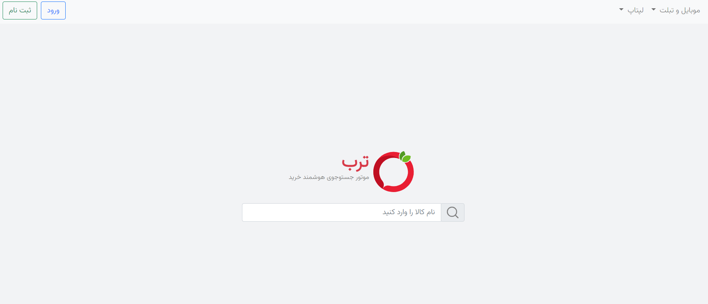
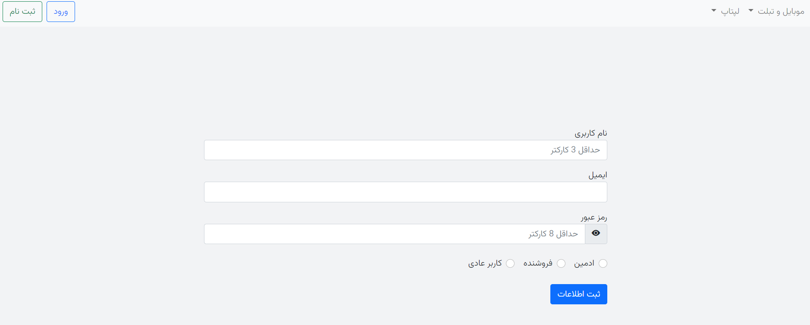
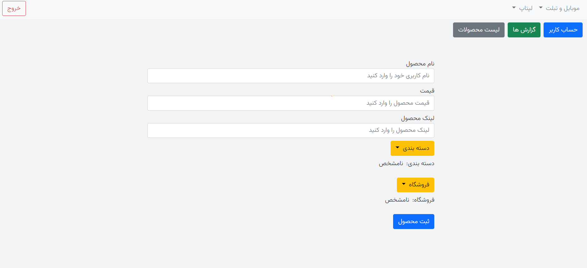

# Torob Clone Frontend

This template should help get you started developing with Vue 3 in Vite.

built with vue 3 & typescript.

## Screenshots





## Customize configuration

See [Vite Configuration Reference](https://vitejs.dev/config/).

## Project Setup

```sh
npm install
```

### Compile and Hot-Reload for Development

```sh
npm run dev
```

### Type-Check, Compile and Minify for Production

```sh
npm run build
```

### Run Unit Tests with [Vitest](https://vitest.dev/)

```sh
npm run test:unit
```

### Run End-to-End Tests with [Cypress](https://www.cypress.io/)

```sh
npm run build
npm run test:e2e # or `npm run test:e2e:ci` for headless testing
```

### Lint with [ESLint](https://eslint.org/)

```sh
npm run lint
```
